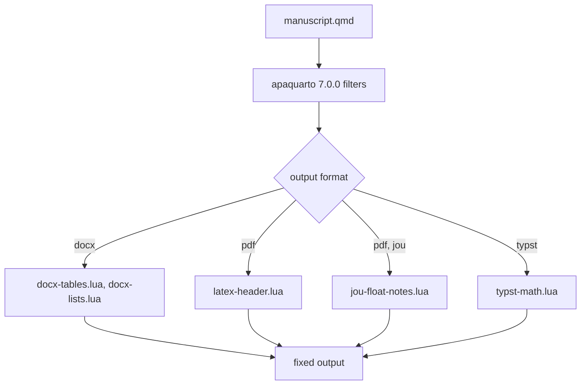

# Fixing apaquarto 7.0.0 layout with apa-layout

apa-layout is a Quarto filter add-on that works around layout bugs in
apaquarto 7.0.0 manuscripts, one filter per bug.

---

## Overview

apaquarto 7.0.0 mostly produces APA-formatted manuscripts, but a few layout
details come out wrong in docx, the two-column `jou` PDF, and Typst. apa-layout
fixes those without forking apaquarto:

- **No fork to maintain.** Each fix is a small Lua filter on top of stock
  apaquarto, so you keep receiving upstream releases.
- **One line enables everything.** Every filter checks the output format (and
  `documentmode` for `jou`) itself.
- **Disposable.** When apaquarto fixes a bug, delete the matching filter.

## Quick Start

```bash
quarto add Data-Wise/apa-layout
```

Add a top-level key to the manuscript's front matter (not under a format):

```yaml
filters:
  - Data-Wise/apa-layout
```

Render as usual (`quarto render manuscript.qmd --to apaquarto-docx`, `-pdf`
or `-typst`). Needs Quarto 1.9 or later.

## How It Works



apa-layout's filters run alongside apaquarto's. Two of them run after
apaquarto's own filters (`post-render`) so they can undo what those produced.
A filter that does not apply to the current format returns immediately.

## The Filters

### `docx-tables.lua` (docx)

apaquarto gives every table inside a figure or table float the borderless
`FigureLayout` style, which is meant for a multipanel figure's layout table.
Data tables lose their APA rules. This filter sets any such table that holds no
image back to the reference document's `Table` style. Upstream:
[wjschne/apaquarto#168](https://github.com/wjschne/apaquarto/issues/168).

### `docx-lists.lua` (docx)

Pandoc writes a tight list in Word's single-spaced `Compact` style, which looks
cramped beside the double-spaced body. This filter loosens every list so its
items are double-spaced, as APA asks. PDF builds are unaffected.

### `latex-header.lua` (pdf)

Adds two preamble fixes:

1. **`jou` figures and tables float `[tbp]`.** `floatsintext` makes apaquarto
   set every figure and in-flow table `[H]`. In two columns a tall `[H]` float
   that misses the rest of a column jumps to the next one, and because jou
   columns are flush-bottom the blank space is spread inside the column. Tables
   that ask to span both columns (`apa-twocolumn`) are untouched.
2. **`\Needspace` before in-flow table titles.** A caption could be stranded at
   a page foot, away from its table. Floats are untouched. Upstream:
[wjschne/apaquarto#170](https://github.com/wjschne/apaquarto/issues/170).

### `jou-float-notes.lua` (pdf, `jou`)

A code-chunk figure's `apa-note` is written after `\end{figure}`. Once `jou`
figures float, the note is left behind in the text column. This filter moves
`\end{figure}` after the note. Upstream:
[wjschne/apaquarto#169](https://github.com/wjschne/apaquarto/issues/169).

### `typst-math.lua` (typst)

Pandoc's math conversion writes `\bigl(` as a scale box that keeps its
unscaled width (a gap inside the delimiter), and `\!\left(` as a negative kern
that makes the preceding symbol collide with the parenthesis. The filter drops
both; Typst sizes matched delimiters itself.

## Verifying the Fixes

```bash
tests/run.sh          # render the fixture, run 10 checks
tests/prove-fail.sh   # disable each filter in turn; each check must fail
```

`tests/run.sh` renders a small fixture manuscript to docx, Typst and `jou` PDF
with a vendored apaquarto 7.0.0 and this repo's filters. It needs Quarto 1.9 or
later, LuaLaTeX, `pdftotext`, `python3`, and R with knitr, rmarkdown, ragg and
svglite. See the
[reference card](../reference/REFCARD-APA-LAYOUT.md) for the check-to-filter
map. CI runs both scripts on every PR.

## Troubleshooting

### `quarto add` put the extension in `Data-Wise/`, not `dtofighi/`

Quarto names the folder after the GitHub repo owner. Use
`filters: [Data-Wise/apa-layout]`. A copy made by hand under
`_extensions/dtofighi/` is referenced as `dtofighi/apa-layout`; both names
work because a filter reference is only a folder path.

### In `jou`, a wide table prints over the next column

A table wider than one column overprints its neighbor. Ask apaquarto to span
it across both columns by adding `apa-twocolumn="true"` to the caption
attributes: `: Caption {#tbl-wide apa-twocolumn="true"}`. It has no effect in
man, docx or Typst. A wide table's overfull lines (about 70 pt) in the
`lualatex -draftmode` log are the symptom.

### A fix does not seem to apply

Check that `filters:` is at the top level of the front matter, not under a
format. The filters skip any format they do not handle, so a wrong placement
fails silently.

### LaTeX stops with "You can't use macro parameter character #"

You are editing TeX that `latex-header.lua` injects inside `\AtBeginDocument`.
Write `#1`, not `##1`, there.

### Overfull boxes do not show in `quarto render` output

Quarto's stdout carries no LaTeX warnings. Compile the kept `.tex` with
`lualatex -draftmode` (twice) and read that log.

### The docx looks wrong in Preview or TextEdit

macOS Quick Look, Preview and TextEdit ignore Word table styles, show numbered
lists as bullets and drop equations. Check the docx in Microsoft Word.

## Related

- [Quick start](../QUICK-START.md)
- [Reference card](../reference/REFCARD-APA-LAYOUT.md)
- [Changelog](https://github.com/Data-Wise/apa-layout/blob/main/CHANGELOG.md)
